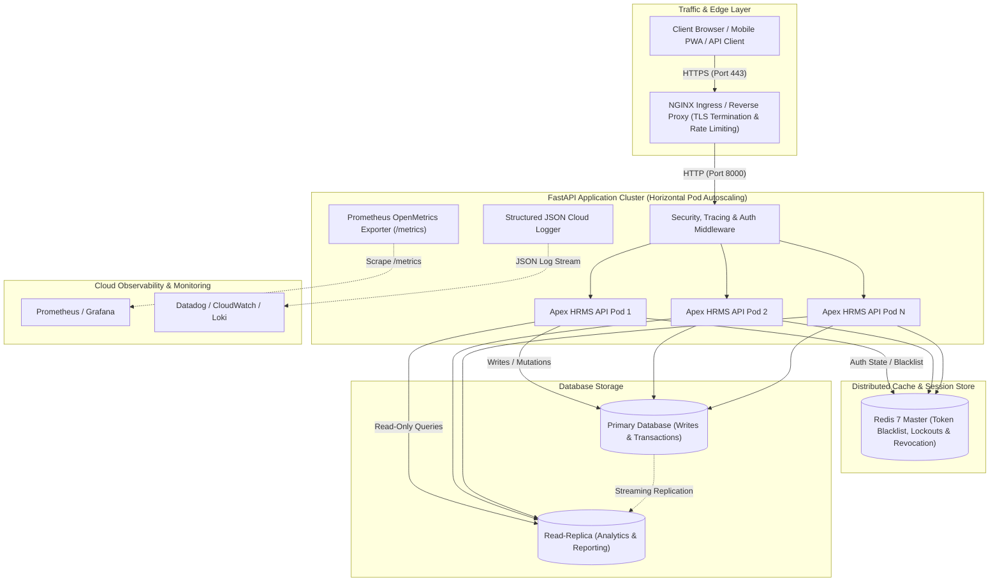

# ⚡ Apex HRMS: Enterprise Workforce Intelligence, Statutory Payroll & Observability Platform

<div align="center">


**Next-Generation Cloud-Native Workforce Management, Multi-Center Scoping, Indian Statutory Payroll Engine & Real-Time Shift Intelligence**

🌐 **Live Production App:** [https://web-production-767f6.up.railway.app](https://web-production-767f6.up.railway.app)

[Features](#-key-features) • [Architecture](#-enterprise-system-architecture) • [User Manual (USER_MANUAL.md)](USER_MANUAL.md) • [Operations Runbook (RUNBOOK.md)](RUNBOOK.md) • [Postman Collection](docs/Apex_HRMS_Postman_Collection.json) • [Live Demo Credentials](#-demo--evaluation-credentials) • [Quick Start](#-quick-start-guide)

</div>

---

## 🌟 Key Features

1. **Dual Runtime Interface (Web & Terminal CLI):**
   * **Web Application:** Dark glassmorphic Single Page Application (SPA) with off-canvas mobile drawer, Chart.js analytics, and interactive CTC & salary calculators.
   * **Terminal CLI:** Full interactive terminal console (`python main.py --cli`) preserving original command-line CRUD operations (`addrec`, `updrec`, `disrec`, `delrec`).

2. **Role-Based Access Control (RBAC) & Multi-Center Isolation:**
   * 👑 **Admin:** Enterprise-wide visibility, master employee lifecycle, cross-center payroll batch execution, manager leave approvals, and immutable audit logs.
   * 👔 **Regional Manager:** Scoped to designated regional branch (e.g. Bangalore, Delhi, Mumbai, Kolkata). Conducts 360 appraisals, manages team leaves, uploads staff documents, and applies for personal leaves routed to HQ Admin.
   * 💻 **Employee:** Self-service workspace with compensation breakdown, leave balance tracker, 360 appraisal review acknowledgement, personal compliance document vault, and instant PDF payslip downloads.

3. **Advanced Daily Attendance, Shift & Break Engine:**
   * **Scheduled Shift Standards:** Default `General Shift (09:00 AM – 06:00 PM IST • 8.0h Target)` with live visual shift progress bar.
   * **IST Punctuality Evaluation:** Evaluated against 09:00 AM IST with a 15-minute grace period (`🟢 Early Arrival`, `🟢 On-Time / Punctual`, `🟡 Late by X mins`).
   * **Break Time Management:** `☕ Take Break` / `▶ Resume Work` toggle with live break stopwatch and automatic net working hour deductions.
   * **Dynamic Overtime Tracking:** Shifts exceeding 8.0 hours net active time trigger live `🔥 Overtime` badge and overtime hour calculations.
   * **Audited Device & IP Logging:** Captures browser/OS metadata and client IP for compliance auditing.
   * **Double Clock-In Prevention:** Strict backend check enforcing a single active shift per employee.
   * **Multi-Step Confirmation Dialogs:** Post check-in summary modal and pre clock-out shift review dialog.

4. **Automated Statutory Indian Payroll & TrueType PDF Engine:**
   * **High-Precision Math:** Pure Python `Decimal` and database `Numeric(12, 2)` for basic salary (50%), HRA (20%), allowances (30%), PF (12%), and progressive tax.
   * **Strict State Machine:** Lifecycle progression: `DRAFT` $\rightarrow$ `CALCULATED` $\rightarrow$ `APPROVED` $\rightarrow$ `PAID`.
   * **ORM Immutability:** SQLAlchemy event hooks prevent mutation or physical deletion of finalized paid payroll records.
   * **ReportLab PDF Engine:** Dynamic TrueType Unicode font embedding for native Rupee (`₹`) symbol rendering.

5. **360 Performance Appraisals & Document Compliance Vault:**
   * **Quarterly/Annual Reviews:** Structured appraisals (1–5 Star Rating, Goal Alignment, Key Strengths, Areas for Development, Manager Remarks).
   * **Employee Acknowledgement:** Two-way feedback loop allowing employees/managers to acknowledge evaluations and submit responses.
   * **Encrypted Document Vault:** Secure storage for employee onboarding IDs, tax declarations, and educational certificates.

6. **Cloud Observability & OpenMetrics APM:**
   * **Prometheus Metrics (`/metrics`):** Request counters, latency histograms (5ms to 10s buckets), active DB pool connections, cache hit/miss rates, and process uptime.
   * **Structured JSON Cloud Logging:** Emits structured single-line JSON logs with ISO-8601 timestamps, request IDs, client IPs, HTTP methods, paths, and status codes.

---

## 🏗 Enterprise System Architecture



---

## 🔐 Demo / Evaluation Credentials

| Role | Employee ID | Center / Branch | Demo Password | Access Scope |
| :--- | :--- | :--- | :--- | :--- |
| 👑 **Admin** | `9924101` | Corporate HQ (`99`) | `admin123` | Enterprise-wide access across all centers & global payroll |
| 👔 **Manager** | `1023101` | Bangalore (`10`) | `manager123` | Bangalore center operations, team appraisals & attendance |
| 👔 **Manager** | `2023101` | Delhi (`20`) | `manager123` | Delhi center operations, team appraisals & attendance |
| 👔 **Manager** | `3023101` | Mumbai (`30`) | `manager123` | Mumbai center operations, team appraisals & attendance |
| 💻 **Employee** | `1025102` | Bangalore (`10`) | `employee123` | Self-service workspace, clock-in, payslips & document vault |
| 💻 **Employee** | `4025101` | Kolkata (`40`) | `employee123` | Self-service workspace, clock-in, payslips & document vault |

---

## 📡 API Endpoint Documentation

All protected endpoints accept a Bearer token: `Authorization: Bearer <access_token>` or an HttpOnly secure session cookie.

### 1. Authentication & Token Lifecycle (`/api/auth`)

| Method | Endpoint | Access Role | Description |
| :--- | :--- | :--- | :--- |
| `POST` | `/api/auth/login` | Public | Authenticate via numeric **Employee ID** and password (includes 5-attempt lockout). |
| `POST` | `/api/auth/refresh` | Public / Cookie | Single-use refresh token exchange with automatic JTI rotation. |
| `GET` | `/api/auth/me` | Authenticated | Retrieve authenticated user profile and linked employee metadata. |
| `POST` | `/api/auth/change-password` | Authenticated | Password update with complexity policy validation. Invalidates all active sessions globally. |
| `POST` | `/api/auth/logout` | Authenticated | Universal logout: revokes token JTIs in distributed Redis blacklist and deletes cookies. |

---

### 2. Daily Attendance & Shift Management (`/api/attendance`)

| Method | Endpoint | Access Role | Description |
| :--- | :--- | :--- | :--- |
| `POST` | `/api/attendance/clock-in` | Authenticated | Daily clock-in with IST punctuality calculation, device/IP logging, and double check-in prevention. |
| `POST` | `/api/attendance/break-start` | Authenticated | Start break session and activate live break timer. |
| `POST` | `/api/attendance/break-end` | Authenticated | End break session and accumulate break duration. |
| `POST` | `/api/attendance/clock-out` | Authenticated | Clock-out, deduct cumulative breaks, compute net active hours, and record overtime (>8.0 hrs). |
| `GET` | `/api/attendance/summary` | Authenticated | Real-time attendance KPIs, active running shift hours, break duration, and punctuality rate. |
| `GET` | `/api/attendance/history` | Authenticated | Attendance logs (Admin sees all; Manager sees center; Employee sees self). |
| `GET` | `/api/attendance/live-status` | `ADMIN`, `MANAGER`| Live snapshot of employees currently on active duty, on break, or completed shifts today. |

---

### 3. Statutory Payroll & Compensation (`/api/payroll`)

| Method | Endpoint | Access Role | Description |
| :--- | :--- | :--- | :--- |
| `POST` | `/api/payroll/generate` | `ADMIN` | Batch compute monthly payroll across centers (`CALCULATED`). |
| `POST` | `/api/payroll/{id}/approve` | `ADMIN`, `MANAGER` | Formally approve a calculated payroll record (`CALCULATED` $\rightarrow$ `APPROVED`). |
| `POST` | `/api/payroll/{id}/disburse` | `ADMIN` | Mark approved record as paid/disbursed (`APPROVED` $\rightarrow$ `PAID` with immutability lock). |
| `GET` | `/api/payroll` | Authenticated | List payroll history scoped by role. |
| `GET` | `/api/payroll/payslip/{id}/pdf` | Authenticated | Stream and download corporate PDF payslip with native Indian Rupee (`₹`) glyphs. |

---

### 4. Performance & 360 Appraisals (`/api/performance`)

| Method | Endpoint | Access Role | Description |
| :--- | :--- | :--- | :--- |
| `POST` | `/api/performance/reviews` | `ADMIN`, `MANAGER` | Author structured performance appraisal (Rating, Goals, Strengths, Feedback). |
| `GET` | `/api/performance/reviews` | Authenticated | List performance appraisals scoped by role. |
| `PATCH`| `/api/performance/reviews/{id}/acknowledge`| Authenticated | Self-acknowledgement with employee/manager response comments. |

---

### 5. Document Vault & Compliance (`/api/documents`)

| Method | Endpoint | Access Role | Description |
| :--- | :--- | :--- | :--- |
| `POST` | `/api/documents/upload` | Authenticated | Upload compliance certificate/ID with MIME and size verification. |
| `GET` | `/api/documents/employee/{eid}` | Authenticated | List employee compliance documents (scoped by role/center). |
| `GET` | `/api/documents/download/{id}` | Authenticated | Secure file download stream. |
| `DELETE`| `/api/documents/{id}` | Authenticated | Delete document with audit logging. |

---

### 6. Leaves & PTO Management (`/api/leaves`)

| Method | Endpoint | Access Role | Description |
| :--- | :--- | :--- | :--- |
| `POST` | `/api/leaves` | Authenticated | Submit leave application (`SICK`, `CASUAL`, `PTO`, `UNPAID`). Manager leaves route to Admin. |
| `GET` | `/api/leaves` | Authenticated | List leave applications filtered by status. |
| `PATCH`| `/api/leaves/{id}/status`| `ADMIN`, `MANAGER` | Approve/Reject leave with mandatory reviewer remarks (self-approval prohibited). |

---

## 🚀 Quick Start Guide

### 1. Clone & Install
```bash
git clone https://github.com/sohan1saha/employee-management.git
cd employee-management

pip install -r requirements.txt
```

### 2. Initialize Database & Seed Master Records
```bash
python seed_data.py
```

### 3. Run Development Server
```bash
python main.py
```
* 🌐 **Web Dashboard:** [http://127.0.0.1:8000](http://127.0.0.1:8000)
* 📖 **Interactive Swagger Docs:** [http://127.0.0.1:8000/docs](http://127.0.0.1:8000/docs)
* 📑 **Alternative Redoc Docs:** [http://127.0.0.1:8000/redoc](http://127.0.0.1:8000/redoc)

---

## 🧪 Automated Testing & Quality Gates

Run the comprehensive 26-test integration suite:

```bash
python -m pytest tests/ -v
```

The test suites validate:
* **Token Security:** 15m JWT lifetime, 7d refresh token rotation, universal logout revocation, brute-force lockout.
* **Attendance & Shifts:** Punctuality evaluation, break start/accumulation/end, overtime recording, double clock-in prevention, device logging.
* **Financial Precision & Immutability:** Pure `Decimal` salary calculations, strict lifecycle state transitions (`DRAFT` $\rightarrow$ `PAID`), and ORM-level modification rejection for paid payroll records.
* **Multi-Tenant Isolation:** Cross-center access boundaries and IDOR object-level protection.
* **Document Vault & Notifications:** Secure multipart uploads, MIME verification, and automated in-app alerts.
* **Disaster Recovery:** Automated dump, gzip compression, AES-256 authenticated encryption, and restore integrity tests.

---

## 👤 Author & Maintainer

**Sohan Saha**
* GitHub: [@sohan1saha](https://github.com/sohan1saha)
* Repository: [https://github.com/sohan1saha/employee-management](https://github.com/sohan1saha/employee-management)
* Live Application: [https://web-production-767f6.up.railway.app](https://web-production-767f6.up.railway.app)

---

## 📄 License

This project is licensed under the MIT License - see the [LICENSE](LICENSE) file for details.
