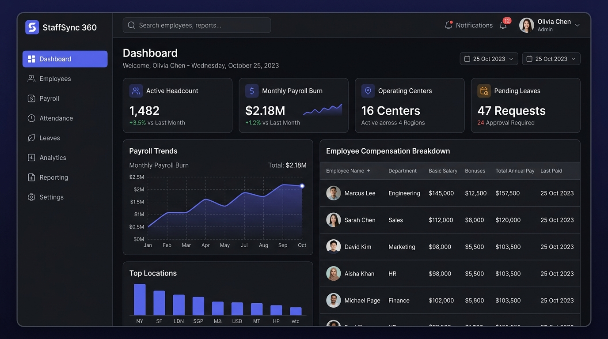

# ⚡ StaffSync 360: Enterprise HRMS, Payroll & Audit Platform

<div align="center">


**Next-Generation Workforce Intelligence, Multi-Center Scoping & Automated Indian Payroll Management Platform**

[Key Features](#-key-features) • [Dashboard Preview](#-dashboard-preview) • [Tech Stack](#-tech-stack) • [System Architecture](#-system-architecture) • [API Documentation](#-api-endpoint-documentation) • [Getting Started](#-getting-started)

</div>

---

## 📸 Dashboard Preview

<div align="center">
  
  <p><em>Executive Analytics Dashboard with Real-Time Workforce KPIs, Center Distribution Charts, and Financial Metrics</em></p>
</div>

---

## 🌟 Key Features

1. **Dual Runtime Interface (Web & CLI):**
   * **Web Dashboard:** Glassmorphic, dark-mode Single Page Application (SPA).
   * **Terminal CLI:** Full terminal management (`python main.py --cli`) preserving the foundational CRUD commands (`addrec`, `updrec`, `disrec`, `delrec`).

2. **Role-Based Access Control (RBAC) & Multi-Center Data Scoping:**
   * 👑 **Admin:** Enterprise-wide visibility, employee lifecycle management, full payroll runs, and security audit logs.
   * 👔 **Center Manager:** Strictly scoped to their designated branch center (e.g. Bangalore, Delhi, Mumbai, Kolkata). Accessing other branch data returns `403 Forbidden`.
   * 💻 **Employee:** Privacy-isolated self-service workspace with salary breakdown, leave quota tracker, and instant PDF payslip downloads.

3. **Patterned Continuous Employee ID Generation:**
   * Dynamic algorithm generating structured IDs: `[Center Code (2 digits)] + [Joining Year (2 digits)] + [Sequential Serial (3 digits)]` (e.g. `1025101` $\rightarrow$ Bangalore 2025 #101).

4. **Automated Indian Statutory Payroll & ReportLab PDF Generator:**
   * Multi-component compensation: Basic Pay (50%), HRA (20%), Special Allowance (30%), PF (12% of basic), and progressive income tax.
   * On-the-fly corporate PDF payslip generator with dynamic Unicode TrueType font embedding for native Rupee symbol (`₹`) rendering.

5. **Zero-Trust Immutable Audit Vault:**
   * Automated event logging capturing actor Employee ID, action type, target entity, state diffs (`old_value` $\rightarrow$ `new_value`), timestamp, and client IP.

6. **Action Confirmation Safeguards:**
   * Two-step verification dialog (`Proceed` or `Exit`) on crucial actions (employee deletions, salary increases/modifications, and batch payroll execution).

---

## 🛠 Tech Stack

### Backend & Core
* **Language:** Python 3.11+ / 3.13
* **Web Framework:** [FastAPI](https://fastapi.tiangolo.com/) (Asynchronous REST API)
* **Server:** [Uvicorn](https://www.uvicorn.org/) (ASGI Production Server)
* **Data Validation:** [Pydantic v2](https://docs.pydantic.dev/) (Strict type validation & serialization)

### Database & Persistence
* **ORM:** [SQLAlchemy 2.0](https://www.sqlalchemy.org/) (Object Relational Mapper)
* **Default Database:** SQLite3 (`staffsync.db`)
* **Cloud Compatibility:** 12-Factor DB agnostic (PostgreSQL, Neon, Supabase, MySQL via `DATABASE_URL`)

### Security & Authentication
* **Token Standard:** JSON Web Tokens (JWT via `python-jose` HS256)
* **Password Hashing:** [Passlib](https://passlib.readthedocs.io/) with `bcrypt` algorithms
* **Authorization:** Custom Dependency Injection middleware enforcing RBAC and Regional Scoping

### Document Generation & PDF Engine
* **Engine:** [ReportLab](https://www.reportlab.com/) (Flowable canvas & tables)
* **Typography:** Dynamic Unicode TrueType Font Metrics (`Segoe UI`, `Arial`, `Nirmala UI` for native `₹` glyphs)

### Frontend (Single Page App)
* **Core:** HTML5 Semantic Layout, Modern CSS3 Variables & Glassmorphism
* **Logic:** Vanilla JavaScript (ES6+ `async/await`, dynamic DOM controller)
* **Visualizations:** [Chart.js](https://www.chartjs.org/) (Responsive doughnut & bar analytics)

### Testing & Quality Assurance
* **Test Runner:** [Pytest](https://docs.pytest.org/) (9 automated end-to-end integration test suites)
* **HTTP Testing:** `FastAPI TestClient` & `httpx`

---

## 🏗 System Architecture

### Component Flow Architecture


### Directory Structure

```text
E:\Projects\Employee Management\
├── app\
│   ├── api\                      # REST API Endpoints & Routers
│   │   ├── auth_router.py        # Authentication & self-service password change
│   │   ├── employee_router.py    # Employee CRUD & pattern ID generator
│   │   ├── payroll_router.py     # Payroll batch calculation & PDF streamer
│   │   ├── leave_router.py       # Leave request submissions & manager reviews
│   │   ├── analytics_router.py   # Executive & self-service workforce analytics
│   │   ├── audit_router.py       # Security audit vault access
│   │   └── deps.py               # JWT decode & center scoping dependencies
│   ├── core\                     # Core system configurations & utilities
│   │   ├── config.py             # Environment variables & settings
│   │   ├── database.py           # SQLAlchemy sessionmaker & engine
│   │   ├── security.py           # Bcrypt hashing & JWT token creators
│   │   └── emp_mgmt_core.py      # Preserved CLI CRUD & console menu
│   ├── models\                   # SQLAlchemy ORM database schemas
│   │   ├── employee.py           # Master employee table (em1 evolution)
│   │   ├── user.py               # User authentication & employee bindings
│   │   ├── payroll.py            # Monthly payroll compensation records
│   │   ├── leave.py              # Leave request & review tracking
│   │   └── audit.py              # Immutable audit trail model
│   ├── schemas\                  # Pydantic validation request/response models
│   ├── services\                 # Specialized domain business logic
│   │   ├── payroll_service.py    # Salary breakdown math & ReportLab PDF engine
│   │   ├── analytics_service.py  # KPI aggregation & employee portal metrics
│   │   └── audit_service.py      # Automated audit log recorder
│   └── web\                      # Frontend Single Page Application
│       ├── index.html            # SPA interface with modal safeguards
│       ├── css\style.css         # Dark glassmorphic responsive design system
│       └── js\
│           ├── api.js            # Fetch API client abstraction layer
│           └── app.js            # UI state controller & event bindings
├── docs\                         # Project documentation & visual assets
│   └── assets\                   # Screenshots & diagrams
├── tests\                        # Automated test suites
│   └── test_hrms.py              # 9 comprehensive integration test suites
├── main.py                       # Application runtime entry point (--web / --cli)
├── seed_data.py                  # Database initialization & sample data seeder
├── StaffSync_Credentials_Directory.pdf # Master credentials reference document
├── requirements.txt              # Project dependencies
├── .gitignore                    # Git tracking rules
└── README.md                     # Comprehensive technical documentation
```

---

## 📡 API Endpoint Documentation

All endpoints (except login) require a Bearer token: `Authorization: Bearer <access_token>` or an HTTP-only session cookie.

### 1. Authentication & Security (`/api/auth`)

| Method | Endpoint | Access Role | Description |
| :--- | :--- | :--- | :--- |
| `POST` | `/api/auth/login` | Public | Authenticate via numeric **Employee ID** and password. Returns JWT token. |
| `GET` | `/api/auth/me` | Authenticated | Retrieve authenticated user profile and linked employee metadata. |
| `POST` | `/api/auth/change-password` | Authenticated | Self-service password update (requires `old_password`, `new_password`, `confirm_password`). |
| `POST` | `/api/auth/logout` | Authenticated | Invalidate and clear session cookie. |

<details>
<summary><b>View Sample Login Payload</b></summary>

```json
// POST /api/auth/login
{
  "employee_id": 9924101,
  "password": "admin123"
}

// Response (200 OK)
{
  "access_token": "eyJhbGciOiJIUzI1NiIsInR5cCI6...",
  "token_type": "bearer",
  "user": {
    "id": 1,
    "employee_id": 9924101,
    "email": "eleanor.vance@staffsync.internal",
    "role": "ADMIN",
    "full_name": "Eleanor Vance",
    "display_name": "Eleanor Vance"
  }
}
```
</details>

---

### 2. Employee Management (`/api/employees`)

| Method | Endpoint | Access Role | Description |
| :--- | :--- | :--- | :--- |
| `GET` | `/api/employees` | Authenticated | List employees with optional filters (`search`, `center`, `status`). Scoped for managers & employees. |
| `GET` | `/api/employees/{eid}` | Authenticated | Retrieve individual employee record (scoped by center / self). |
| `GET` | `/api/employees/next-id` | `ADMIN`, `MANAGER` | Get auto-recommended continuous Employee ID based on `center` and `doj`. |
| `GET` | `/api/employees/centers/list` | Authenticated | Get list of centers accessible to current user. |
| `POST` | `/api/employees` | `ADMIN`, `MANAGER` | Register new employee. Center managers restricted to their assigned center. |
| `PUT` | `/api/employees/{eid}` | `ADMIN`, `MANAGER` | Update employee designation, center, salary, or status. Logs audit entry. |
| `DELETE`| `/api/employees/{eid}` | `ADMIN` | Permanently delete employee and cascade linked records. |

---

### 3. Payroll & Compensation (`/api/payroll`)

| Method | Endpoint | Access Role | Description |
| :--- | :--- | :--- | :--- |
| `POST` | `/api/payroll/generate` | `ADMIN` | Batch compute payroll and generate records for a specific month and center. |
| `GET` | `/api/payroll` | Authenticated | List payroll history (Admin sees all; Manager sees center; Employee sees self). |
| `GET` | `/api/payroll/payslip/{id}/pdf` | Authenticated | Stream and download custom corporate PDF payslip with Unicode font rendering. |

---

### 4. Leaves & PTO Management (`/api/leaves`)

| Method | Endpoint | Access Role | Description |
| :--- | :--- | :--- | :--- |
| `POST` | `/api/leaves` | Authenticated | Submit leave application (`SICK`, `CASUAL`, `PTO`, `UNPAID`). |
| `GET` | `/api/leaves` | Authenticated | List leave applications filtered by status (`PENDING`, `APPROVED`, `REJECTED`). |
| `PATCH`| `/api/leaves/{id}/status`| `ADMIN`, `MANAGER` | Approve or reject leave request with reviewer comment. |

---

### 5. Analytics & Workforce Intelligence (`/api/analytics`)

| Method | Endpoint | Access Role | Description |
| :--- | :--- | :--- | :--- |
| `GET` | `/api/analytics/summary` | Authenticated | Returns real-time KPI counts, payroll burn, center distribution, and position stats. For employees, returns self-service dashboard data. |

---

### 6. Security Audit Vault (`/api/audit`)

| Method | Endpoint | Access Role | Description |
| :--- | :--- | :--- | :--- |
| `GET` | `/api/audit/logs` | `ADMIN`, `MANAGER` | Retrieve immutable audit records (Admin sees all; Manager sees center operations). |

---

## 🚀 Getting Started

### 1. Prerequisites
* Python 3.10+ (Python 3.13 recommended)
* Git

### 2. Installation
```bash
# Clone the repository
git clone https://github.com/sohan1saha/employee-management.git
cd employee-management

# Install dependencies
pip install -r requirements.txt
```

### 3. Database Initialization & Seeding
Populate fresh sample employees across regional branches with 7-digit patterned IDs:
```bash
python seed_data.py
```

### 4. Default Login Credentials

| Employee ID | Name | Role | Center / Branch | Password |
| :--- | :--- | :--- | :--- | :--- |
| **`9924101`** | Eleanor Vance | `ADMIN` | Corporate HQ (`99`) | `admin123` |
| **`1023101`** | Sara Chen | `MANAGER` | Bangalore (`10`) | `manager123` |
| **`2023101`** | Vikram Malhotra | `MANAGER` | Delhi (`20`) | `manager123` |
| **`3023101`** | Ananya Roy | `MANAGER` | Mumbai (`30`) | `manager123` |
| **`1025102`** | Alex Turner | `EMPLOYEE` | Bangalore (`10`) | `employee123` |
| **`2024102`** | Priya Sharma | `EMPLOYEE` | Delhi (`20`) | `employee123` |

*(A complete reference document is available in [StaffSync_Credentials_Directory.pdf](StaffSync_Credentials_Directory.pdf)).*

---

## 💻 Running the Platform

### Option A: Launch Web Dashboard & REST API *(Recommended)*
```bash
python main.py
# or
python main.py --web
```
* 🌐 **Web Dashboard:** [http://127.0.0.1:8000](http://127.0.0.1:8000)
* 📖 **Interactive Swagger Docs:** [http://127.0.0.1:8000/docs](http://127.0.0.1:8000/docs)
* 📑 **Alternative Redoc Docs:** [http://127.0.0.1:8000/redoc](http://127.0.0.1:8000/redoc)

### Option B: Interactive Terminal CLI Mode
```bash
python main.py --cli
```

---

## 🧪 Running Automated Tests

Run the complete integration test suite with:
```bash
pytest tests/test_hrms.py -v
```

All 9 test suites validate authentication, password changing, multi-center scoping isolation, salary calculation, continuous ID generator, and PDF generation.

---

## 👤 Author & Maintainer

**Sohan Saha**
* GitHub: [@sohan1saha](https://github.com/sohan1saha)
* Repository: [https://github.com/sohan1saha/employee-management](https://github.com/sohan1saha/employee-management)
