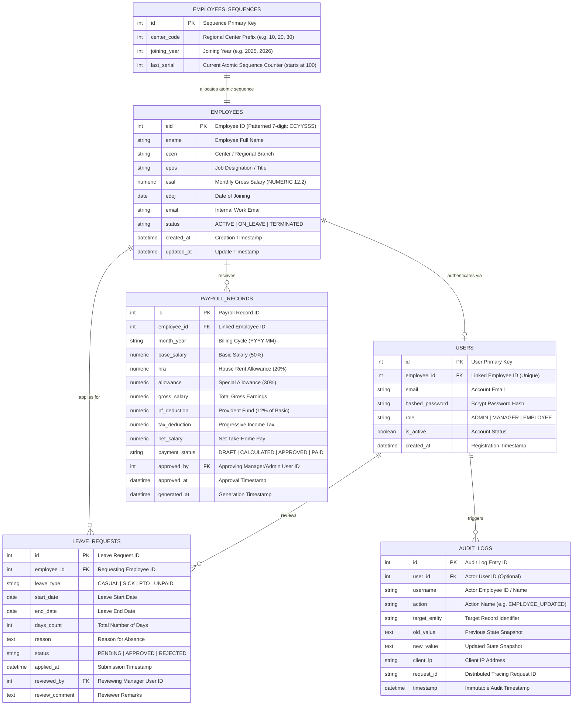

# ⚡ StaffSync 360: Enterprise HRMS, Payroll & Observability Platform

<div align="center">


**Cloud-Native Workforce Intelligence, Multi-Center Scoping, Indian Statutory Payroll Engine & OpenMetrics APM Observability**

[Features](#-key-features) • [Production Architecture](#-enterprise-system-architecture) • [Screenshots](#-application-walkthrough) • [API Docs](#-api-endpoint-documentation) • [Kubernetes Deployment](#-kubernetes-production-deployment) • [Quick Start](#-quick-start-guide) • [Disaster Recovery](#-disaster-recovery--backup-runbook)

</div>

---

## 🌟 Key Features

1. **Dual Runtime Interface (Web & CLI):**
   * **Web Dashboard:** Glassmorphic, dark-mode Single Page Application (SPA) with zero external icon dependencies.
   * **Terminal CLI:** Full interactive terminal console (`python main.py --cli`) preserving foundational CRUD operations (`addrec`, `updrec`, `disrec`, `delrec`).

2. **Role-Based Access Control (RBAC) & Multi-Center Isolation:**
   * 👑 **Admin:** Enterprise-wide visibility, master employee lifecycle, cross-center payroll execution, and immutable audit inspection.
   * 👔 **Center Manager:** Strictly scoped to their designated regional branch (e.g. Bangalore, Delhi, Mumbai, Kolkata). Cross-center reads/mutations return `403 Forbidden`.
   * 💻 **Employee:** Privacy-isolated self-service workspace with compensation breakdown, leave balance tracker, and instant PDF payslip downloads.

3. **Bank-Grade Authentication & Session Lifecycle:**
   * **Token Lifecycle:** 15-minute access tokens + 7-day single-use rotated refresh tokens.
   * **Replay Protection:** Replaying an exchanged refresh token is immediately rejected (`401 Unauthorized`).
   * **Comprehensive Logout:** Revokes all token JTIs in distributed Redis blacklist and wipes HttpOnly secure cookies.
   * **Global User Invalidation:** Password changes trigger `revoke_user_sessions()`, invalidating all active sessions issued prior to the event.
   * **Brute-Force Lockout:** 5 failed attempts trigger an automated 15-minute lockout with audit event logging.

4. **Automated Statutory Indian Payroll & TrueType PDF Engine:**
   * **High-Precision Math:** Pure Python `Decimal` and PostgreSQL `Numeric(12, 2)` for basic salary (50%), HRA (20%), allowances (30%), PF (12%), and progressive tax.
   * **Exact Cache Serialization:** Preserves `Decimal` as exact strings (`"100000.00"`), eliminating IEEE-754 binary floating-point rounding errors.
   * **Strict State Machine:** Lifecycle progression: `DRAFT` (default) $\rightarrow$ `CALCULATED` $\rightarrow$ `APPROVED` $\rightarrow$ `PAID`.
   * **ORM Immutability:** SQLAlchemy event hooks prevent mutation or physical deletion of paid/approved payroll records.
   * **ReportLab PDF Engine:** Dynamic TrueType Unicode font embedding for native Rupee (`₹`) symbol rendering.

5. **Cloud Observability & OpenMetrics Telemetry:**
   * **Prometheus Metrics (`/metrics`):** Real-time request counters, latency histograms (5ms to 10s buckets), active DB pool connections, cache hit/miss rates, and process uptime.
   * **Structured Cloud Logging:** Emits structured single-line JSON logs with ISO-8601 timestamps, request IDs, client IPs, HTTP methods, paths, status codes, and latency in milliseconds for direct ingestion into Datadog, AWS CloudWatch, and Grafana Loki.

6. **Database Scalability & Read-Replica Splitting:**
   * **Read-Replica Routing:** Routes read-heavy analytics and directory queries to read replicas (`DATABASE_READ_REPLICA_URL`) via `get_read_db` while routing write transactions to primary master.
   * **Zero-Downtime Migrations:** `Base.metadata.create_all()` removed from application startup; schema evolution is strictly managed via Alembic migrations.
   * **Continuous Atomic Sequence:** Center-partitioned sequences via `EmployeeSequence` with database row-level locking (`with_for_update()`) and thread locking (`threading.Lock()`).

7. **Disaster Recovery & Off-Site Encryption:**
   * Automated daily backups with mandatory AES-256 symmetric GPG encryption.
   * Fail-fast off-host sync to AWS S3 (`s3://${S3_BUCKET}/`) or remote webhook endpoints.
   * Automated restore integration tests verifying schema, tables, and row count integrity.

---

## 🏗 Enterprise System Architecture

```mermaid
flowchart TD
    subgraph Ingress["Traffic & Edge Layer"]
        User["Client Browser / API Client"]
        K8sIngress["NGINX Ingress / Reverse Proxy (TLS Termination & Rate Limiting)"]
    end

    subgraph AppCluster["FastAPI Application Pods (Horizontal Pod Autoscaling)"]
        FastAPI1["StaffSync API Pod 1"]
        FastAPI2["StaffSync API Pod 2"]
        FastAPIN["StaffSync API Pod N"]
        
        AuthMW["Security, Tracing & HTTPS Middleware"]
        PromMetrics["Prometheus OpenMetrics Exporter (/metrics)"]
        JSONLogger["Structured JSON Cloud Logger"]
    end

    subgraph CacheCluster["Distributed Cache & Session Store"]
        RedisMaster[("Redis 7 Master (Token Blacklist, Lockouts & Revocation)")]
    end

    subgraph DBCluster["PostgreSQL 16 High-Availability Cluster"]
        PGPrimary[("PostgreSQL Master (Writes & Transactions)")]
        PGReplica[("PostgreSQL Read-Replica (Analytics & Read Queries)")]
    end

    subgraph Observability["Cloud Observability & Monitoring"]
        PrometheusServer["Prometheus / Grafana"]
        LogAggregator["Datadog / CloudWatch / Loki"]
    end

    User -->|HTTPS :443| K8sIngress
    K8sIngress -->|HTTP :8000 (Internal)| AuthMW
    AuthMW --> FastAPI1 & FastAPI2 & FastAPIN
    
    FastAPI1 & FastAPI2 & FastAPIN -->|Auth State / Blacklist| RedisMaster
    FastAPI1 & FastAPI2 & FastAPIN -->|Writes / Mutations| PGPrimary
    FastAPI1 & FastAPI2 & FastAPIN -->|Read-Only Queries| PGReplica
    PGPrimary -.->|Streaming Replication| PGReplica

    PromMetrics -.->|Scrape /metrics| PrometheusServer
    JSONLogger -.->|JSON Log Stream| LogAggregator
```

---

## 📸 Application Walkthrough

<div align="center">

### 1. Authentication & Numeric Employee ID Sign In

<p><em>Numeric Employee ID login with brute-force protection and show/hide password toggle.</em></p>

---

### 2. Executive Workforce Analytics Dashboard

<p><em>Real-time KPI metrics, headcount trends, monthly payroll burn, and department allocations.</em></p>

---

### 3. Multi-Center Scoped Employee Management

<p><em>Master directory with continuous ID calculation, center filters, and two-step action confirmation.</em></p>

---

### 4. Employee Self-Service Workspace

<p><em>Personalized compensation breakdown, leave balance tracker, and downloadable payslips.</em></p>

---

### 5. Automated Payroll Engine & State Transitions

<p><em>1-Click batch payroll computation across branches with deduction breakdowns and approval workflows.</em></p>

---

### 6. Statutory PDF Payslip Generation

<p><em>ReportLab corporate payslip with dynamic Unicode TrueType font embedding for native Indian Rupee (₹) symbol.</em></p>

---

### 7. Leaves & PTO Approval Workflow

<p><em>Leave request submission with manager approval/rejection audit tracking and quota validation.</em></p>

---

### 8. Interactive Workforce Visualizations

<p><em>Chart.js visualizations for regional headcount, salary expenditure, and department distribution.</em></p>

</div>

---

## 🗄 Database Entity-Relationship (ER) Diagram



---

## 📡 API Endpoint Documentation

All protected endpoints accept a Bearer token: `Authorization: Bearer <access_token>` or an HttpOnly secure session cookie.

### 1. Authentication & Token Lifecycle (`/api/auth`)

| Method | Endpoint | Access Role | Description |
| :--- | :--- | :--- | :--- |
| `POST` | `/api/auth/login` | Public | Authenticate via numeric **Employee ID** and password. Includes 5-attempt brute-force lockout (15m). |
| `POST` | `/api/auth/refresh` | Public / Cookie | Single-use refresh token exchange. Revokes old JTI and issues new access + refresh token pair. |
| `GET` | `/api/auth/me` | Authenticated | Retrieve authenticated user profile and linked employee metadata. |
| `POST` | `/api/auth/change-password` | Authenticated | Self-service password update with complexity policy validation. Invalidates all active user sessions globally. |
| `POST` | `/api/auth/logout` | Authenticated | Universal logout: revokes bearer and cookie token JTIs in distributed Redis blacklist and deletes cookies. |

---

### 2. Employee Management (`/api/employees`)

| Method | Endpoint | Access Role | Description |
| :--- | :--- | :--- | :--- |
| `GET` | `/api/employees` | Authenticated | List employees with optional filters (`search`, `center`, `status`). Scoped for managers & employees. |
| `GET` | `/api/employees/{eid}` | Authenticated | Retrieve individual employee record (scoped by center / self with IDOR protection). |
| `GET` | `/api/employees/next-id` | `ADMIN`, `MANAGER` | Get auto-recommended continuous Employee ID based on `center` and `doj`. |
| `GET` | `/api/employees/centers/list` | Authenticated | Get list of regional centers accessible to current user. |
| `POST` | `/api/employees` | `ADMIN`, `MANAGER` | Register new employee with atomic concurrency sequence allocation. |
| `PUT` | `/api/employees/{eid}` | `ADMIN`, `MANAGER` | Update employee designation, center, salary, or status. Emits structured audit log. |
| `DELETE`| `/api/employees/{eid}` | `ADMIN` | Soft-delete / deactivate employee (sets status to `TERMINATED`, revokes login, preserves payroll/audit history). |

---

### 3. Statutory Payroll & Compensation (`/api/payroll`)

| Method | Endpoint | Access Role | Description |
| :--- | :--- | :--- | :--- |
| `POST` | `/api/payroll/generate` | `ADMIN` | Batch compute payroll with high-precision `Decimal` math for a specific month and center. Default: `CALCULATED`. |
| `POST` | `/api/payroll/{id}/approve` | `ADMIN`, `MANAGER` | Formally approve a calculated payroll record (`CALCULATED` $\rightarrow$ `APPROVED`). |
| `POST` | `/api/payroll/{id}/disburse` | `ADMIN` | Mark approved record as paid/disbursed (`APPROVED` $\rightarrow$ `PAID`). |
| `GET` | `/api/payroll` | Authenticated | List payroll history (Admin sees all; Manager sees center; Employee sees self). |
| `GET` | `/api/payroll/payslip/{id}/pdf` | Authenticated | Stream and download corporate PDF payslip with native Rupee (`₹`) glyphs. |

---

### 4. Leaves & PTO Management (`/api/leaves`)

| Method | Endpoint | Access Role | Description |
| :--- | :--- | :--- | :--- |
| `POST` | `/api/leaves` | Authenticated | Submit leave application (`SICK`, `CASUAL`, `PTO`, `UNPAID`). |
| `GET` | `/api/leaves` | Authenticated | List leave applications filtered by status (`PENDING`, `APPROVED`, `REJECTED`). |
| `PATCH`| `/api/leaves/{id}/status`| `ADMIN`, `MANAGER` | Approve or reject leave request with mandatory reviewer comment. |

---

### 5. Analytics & Workforce Intelligence (`/api/analytics`)

| Method | Endpoint | Access Role | Description |
| :--- | :--- | :--- | :--- |
| `GET` | `/api/analytics/summary` | Authenticated | Returns real-time KPI counts, payroll burn, center distribution, and position stats. Scoped per role. |

---

### 6. Security Audit Vault (`/api/audit`)

| Method | Endpoint | Access Role | Description |
| :--- | :--- | :--- | :--- |
| `GET` | `/api/audit/logs` | `ADMIN`, `MANAGER` | Retrieve immutable audit records (Admin sees all; Manager sees center operations). |

---

### 7. Observability & Health Probes

| Method | Endpoint | Access Role | Description |
| :--- | :--- | :--- | :--- |
| `GET` | `/metrics` | Public / Scraper | OpenMetrics & Prometheus telemetry exposition format (latency histograms, request counts, pool stats). |
| `GET` | `/healthz` | Public | Kubernetes Liveness Probe. |
| `GET` | `/readyz` | Public | Kubernetes Readiness Probe (verifies database & cache connectivity). |
| `GET` | `/api/system/health` | Authenticated | Deep diagnostic system health report. |

---

## ☸️ Kubernetes Production Deployment

StaffSync 360 includes production-ready Kubernetes manifests in the [`k8s/`](k8s/) directory:

```bash
# 1. Create dedicated namespace
kubectl create namespace staffsync

# 2. Apply ConfigMap and Secrets (populate your production secrets)
kubectl apply -f k8s/configmap.yaml
kubectl apply -f k8s/secrets.yaml.template

# 3. Deploy Service, Ingress, PodDisruptionBudget, and Autoscaler
kubectl apply -f k8s/service.yaml
kubectl apply -f k8s/ingress.yaml
kubectl apply -f k8s/pdb.yaml
kubectl apply -f k8s/hpa.yaml

# 4. Deploy Application Workloads
kubectl apply -f k8s/deployment.yaml

# 5. Check deployment & autoscaler status
kubectl get pods,hpa,pdb -n staffsync
```

---

## 🚀 Quick Start Guide

### 1. Clone & Install
```bash
git clone https://github.com/sohan1saha/employee-management.git
cd employee-management

pip install -r requirements.txt
```

### 2. Initialize Database & Seed Demo Data
Populates master employee records with structured 7-digit IDs across regional branches:
```bash
python seed_data.py
```

### 3. Demo / Evaluation Credentials

> [!NOTE]
> **Evaluation Credentials Notice:** The credentials below are provided strictly for local demonstration and evaluation of the 3-tier RBAC system. In production deployments, change all default passwords immediately via the in-app **Change Password** security settings.

| Role | Employee ID | Center / Branch | Demo Password | Access Scope |
| :--- | :--- | :--- | :--- | :--- |
| 👑 **Admin** | `9924101` | Corporate HQ (`99`) | `admin123` | Enterprise-wide access across all centers |
| 👔 **Manager** | `1023101` | Bangalore (`10`) | `manager123` | Bangalore center employees & audit logs |
| 👔 **Manager** | `2023101` | Delhi (`20`) | `manager123` | Delhi center employees & audit logs |
| 👔 **Manager** | `3023101` | Mumbai (`30`) | `manager123` | Mumbai center employees & audit logs |
| 💻 **Employee** | `1025102` | Bangalore (`10`) | `employee123` | Self-service portal & personal payslips |
| 💻 **Employee** | `2024102` | Delhi (`20`) | `employee123` | Self-service portal & personal payslips |

*(For a printable master account reference sheet, see [DEMO_CREDENTIALS.pdf](DEMO_CREDENTIALS.pdf)).*

---

## 💻 Running the Application

### Option A: 1-Click Production Docker Compose *(Recommended for Local Testing)*
```bash
# Starts FastAPI App, PostgreSQL 16, Redis 7, NGINX Reverse Proxy, and Backup Service
docker compose up -d --build
```
* 🌐 **Production Web Application:** [http://localhost](http://localhost) (Redirects to HTTPS on 443)
* 📊 **Prometheus Metrics:** [http://localhost/metrics](http://localhost/metrics)
* 🩺 **Deep Diagnostic Report:** [http://localhost/api/system/health](http://localhost/api/system/health)

---

### Option B: Local Python Development Server
```bash
python main.py
# or
python main.py --web
```
* 🌐 **Web Dashboard:** [http://127.0.0.1:8000](http://127.0.0.1:8000)
* 📖 **Interactive Swagger Docs:** [http://127.0.0.1:8000/docs](http://127.0.0.1:8000/docs)
* 📑 **Alternative Redoc Docs:** [http://127.0.0.1:8000/redoc](http://127.0.0.1:8000/redoc)

---

### Option C: Interactive Terminal CLI Mode *(Original Script Evolution)*
```bash
python main.py --cli
```

---

## 🗄 Database Migrations (Alembic)

StaffSync 360 uses version-controlled database schema migrations:

```bash
# Run latest database migrations
alembic upgrade head

# Create a new automated migration after modifying models
alembic revision --autogenerate -m "add_custom_fields"
```

---

## 💾 Disaster Recovery & Backup Runbook

### 1. Execute Manual Encrypted Backup
```bash
ENCRYPTION_PASSPHRASE="YourSecurePassphraseHere" ./scripts/backup_db.sh
```

### 2. Restore Database from Encrypted Snapshot
```bash
ENCRYPTION_PASSPHRASE="YourSecurePassphraseHere" ./scripts/restore_db.sh /backups/staffsync_backup_20260816.sql.gz.enc
```

---

## 🧪 Automated Testing & Security Quality Gates

### 1. Pytest Integration Suite & Coverage (21 Test Suites)
```bash
pytest tests/ -v --cov=app --cov-report=term-missing
```

The 21 test suites validate:
* **Authentication & Tokens:** 15m JWT lifetime, 7d refresh token rotation, replay attack prevention, universal logout revocation, brute-force lockout (5 attempts $\rightarrow$ 15m).
* **Cryptographic & Password Policies:** Password complexity enforcement and missing production secret startup crash protection.
* **Financial Precision & Immutability:** Pure Decimal salary calculations, strict lifecycle state transitions (`DRAFT` $\rightarrow$ `CALCULATED` $\rightarrow$ `APPROVED` $\rightarrow$ `PAID`), and ORM-level modification/deletion rejection for paid payroll records.
* **Audit Trail Integrity:** Immutable append-only audit log enforcement via SQLAlchemy event listeners.
* **Concurrency & ID Allocation:** Multi-threaded stress testing proving atomic, collision-free sequential employee ID generation with row locks.
* **Multi-Tenant Scoping:** Cross-center access boundaries and IDOR object-level protection.
* **Disaster Recovery & Data Protection:** Automated PostgreSQL/SQLite dump, gzip compression, AES-256 authenticated encryption, and complete restore integrity tests.
* **Observability & Read-Replicas:** Prometheus `/metrics` exposition and database read-replica query routing.

### 2. AST Security Vulnerability Scan (Bandit)
```bash
bandit -r app/ -ll --exclude app/web
```

---

## 👤 Author & Maintainer

**Sohan Saha**
* GitHub: [@sohan1saha](https://github.com/sohan1saha)
* Repository: [https://github.com/sohan1saha/employee-management](https://github.com/sohan1saha/employee-management)

---

## 📄 License

This project is licensed under the MIT License - see the [LICENSE](LICENSE) file for details.
