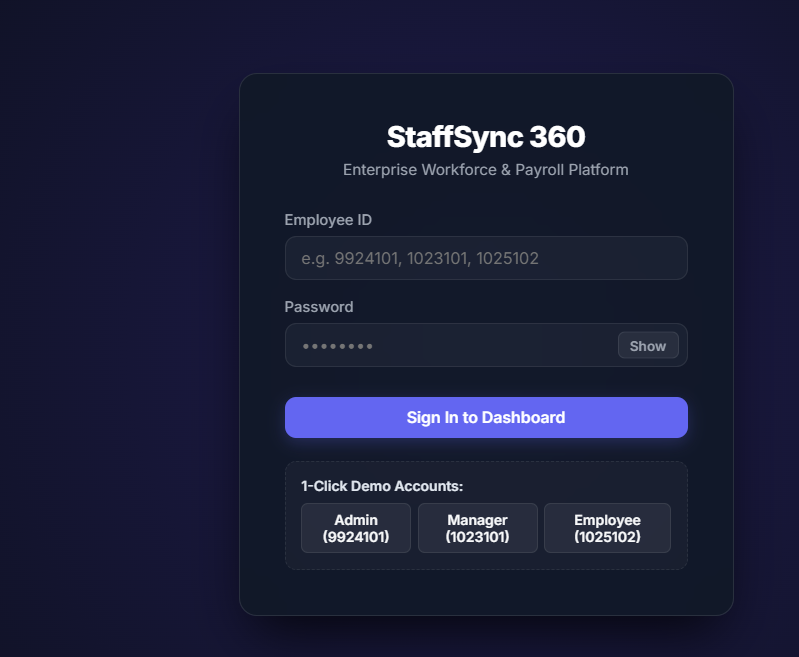
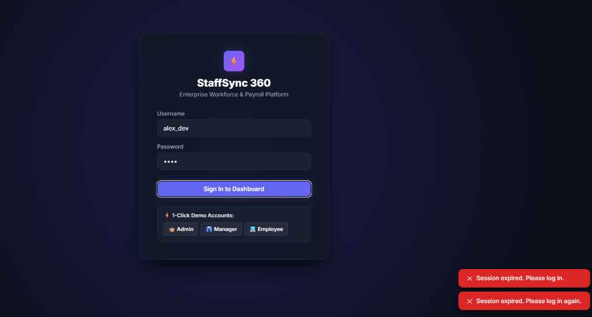
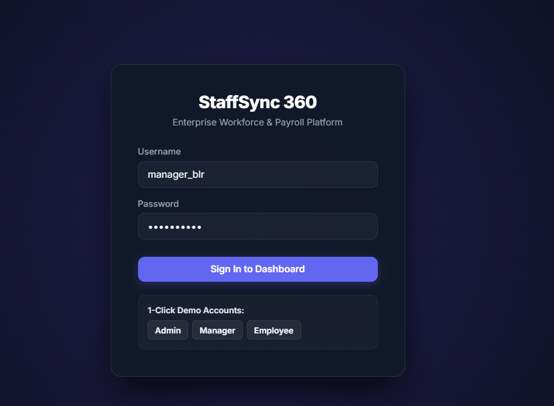
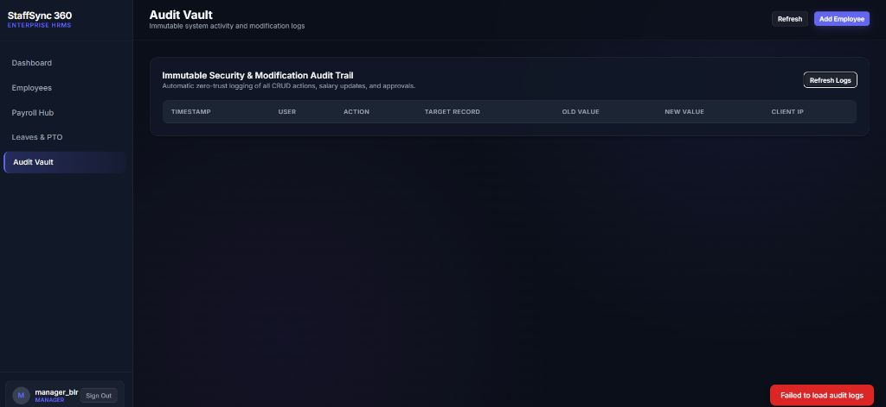
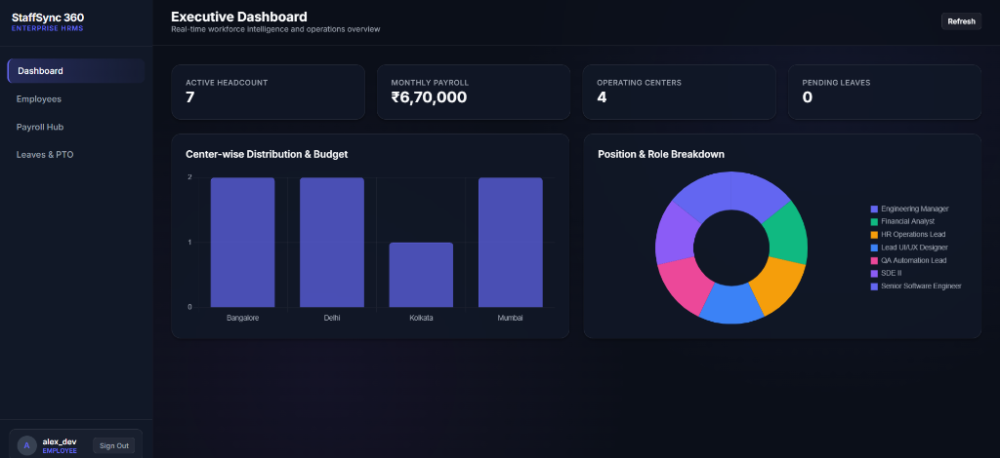
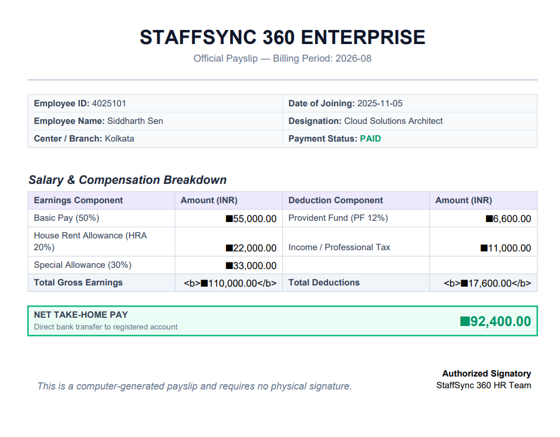
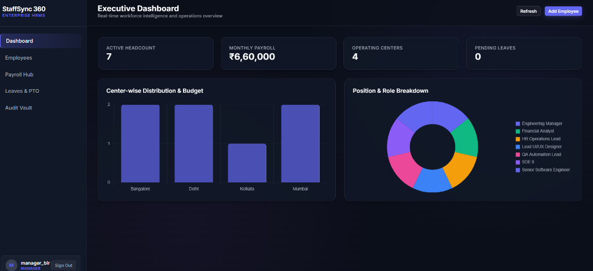
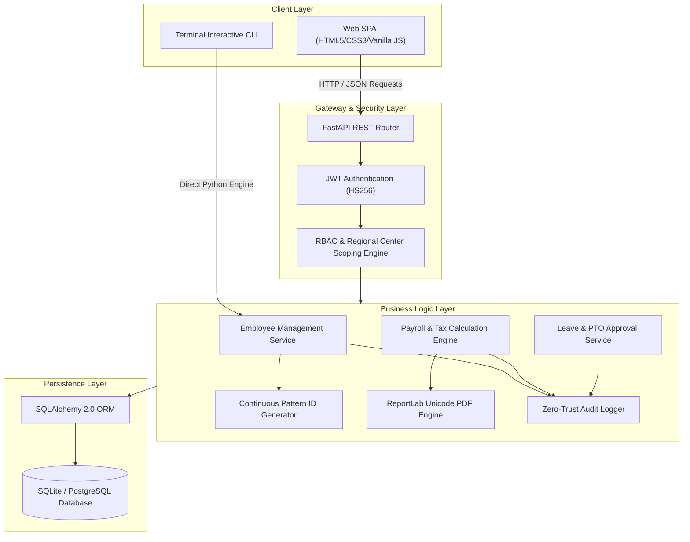
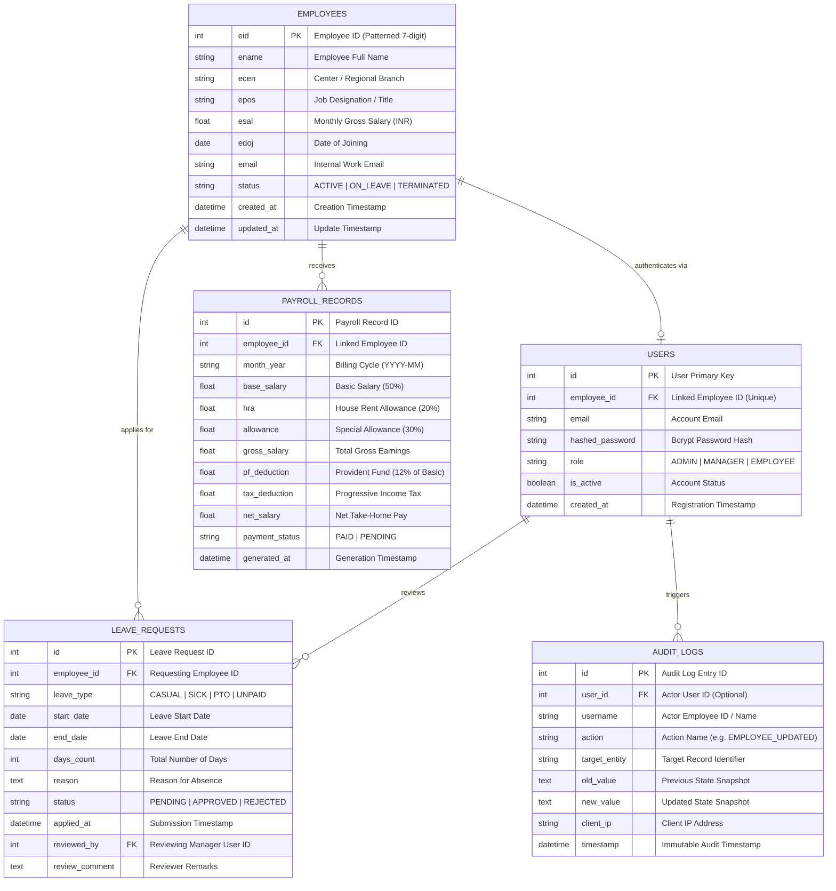

# ⚡ StaffSync 360: Enterprise HRMS, Payroll & Audit Platform

<div align="center">


**Next-Generation Workforce Intelligence, Multi-Center Scoping & Automated Indian Payroll Management Platform**

[Features](#-key-features) • [Screenshots](#-application-screenshots) • [Tech Stack](#-tech-stack) • [Architecture & ER Diagram](#-system-architecture--database-er-diagram) • [API Docs](#-api-endpoint-documentation) • [Quick Start](#-quick-start-guide)

</div>

---

## 🌟 Key Features

1. **Dual Runtime Interface (Web & CLI):**
   * **Web Dashboard:** Glassmorphic, dark-mode Single Page Application (SPA) with no external icon dependencies.
   * **Terminal CLI:** Full interactive terminal console (`python main.py --cli`) preserving the foundational CRUD functions (`addrec`, `updrec`, `disrec`, `delrec`).

2. **Role-Based Access Control (RBAC) & Multi-Center Data Scoping:**
   * 👑 **Admin:** Enterprise-wide visibility, employee lifecycle management, full payroll runs, and security audit logs.
   * 👔 **Center Manager:** Strictly scoped to their designated regional branch center (e.g. Bangalore, Delhi, Mumbai, Kolkata). Attempting to read or mutate cross-center records yields `403 Forbidden`.
   * 💻 **Employee:** Privacy-isolated self-service workspace with live compensation breakdown, leave quota tracker, and instant PDF payslip downloads.

3. **Patterned Continuous Employee ID Generation:**
   * Dynamic auto-recommendation algorithm: `[Center Code (2 digits)] + [Joining Year (2 digits)] + [Sequential Serial (3 digits)]` (e.g. `1025101` $\rightarrow$ Bangalore Center `10`, Joined `2025`, Serial `101`).

4. **Automated Indian Statutory Payroll & ReportLab PDF Generator:**
   * Multi-component compensation math: Basic Pay (50%), HRA (20%), Special Allowance (30%), PF (12% of basic), and progressive income tax estimation.
   * On-the-fly corporate PDF payslip generator with dynamic Unicode TrueType font embedding for native Rupee symbol (`₹`) rendering.

5. **Zero-Trust Immutable Audit Vault:**
   * Automated event logging capturing actor Employee ID, action type, target record, state diffs (`old_value` $\rightarrow$ `new_value`), timestamp, and client IP.

6. **Action Confirmation Safeguards:**
   * Dedicated two-step verification dialog (`Proceed` or `Exit`) on crucial actions (employee deletions, salary increases/modifications, and batch payroll execution).

---

## 📸 Application Screenshots

<div align="center">

### 1. Authentication & Sign In

<p><em>Numeric Employee ID authentication with show/hide password toggle.</em></p>

---

### 2. Executive Admin Dashboard

<p><em>Workforce analytics, real-time KPI metrics, center distribution, and position breakdowns.</em></p>

---

### 3. Employee Management & Scoped Directory

<p><em>Master directory with real-time continuous ID calculation, center filters, and CRUD safeguards.</em></p>

---

### 4. Employee Self-Service Workspace

<p><em>Personalized portal displaying take-home salary structure, leave balances, and company calendar.</em></p>

---

### 5. Payroll Hub & Processing

<p><em>1-Click monthly batch payroll processing across all branches with deduction breakdowns.</em></p>

---

### 6. Official PDF Payslip Generation

<p><em>Computer-generated corporate payslip with native Indian Rupee (₹) symbol rendering.</em></p>

---

### 7. Leaves & PTO Workflow

<p><em>Leave application submission with manager approval/rejection audit tracking.</em></p>

---

### 8. Visual Workforce Analytics

<p><em>Interactive Chart.js visualizations for regional headcount and department allocations.</em></p>

</div>

---

## 🛠 Tech Stack

### Backend & Core
* **Language:** Python 3.11+ / 3.13
* **Web Framework:** [FastAPI](https://fastapi.tiangolo.com/) (Asynchronous High-Performance REST API)
* **Server:** [Uvicorn](https://www.uvicorn.org/) (ASGI Production Server)
* **Data Validation:** [Pydantic v2](https://docs.pydantic.dev/) (Strict type validation & serialization)

### Database & Persistence
* **ORM:** [SQLAlchemy 2.0](https://www.sqlalchemy.org/) (Object Relational Mapper)
* **Default Database:** SQLite3 (`staffsync.db`)
* **Cloud Compatibility:** 12-Factor DB agnostic (PostgreSQL, Neon, Supabase, MySQL via `DATABASE_URL`)

### Security & Authentication
* **Token Standard:** JSON Web Tokens (JWT via `python-jose` HS256)
* **Password Hashing:** [Passlib](https://passlib.readthedocs.io/) with `bcrypt` algorithms
* **Authorization:** Custom Dependency Injection middleware enforcing RBAC and Regional Center Scoping

### Document Generation & PDF Engine
* **Engine:** [ReportLab](https://www.reportlab.com/) (Flowable canvas & tables)
* **Typography:** Dynamic Unicode TrueType Font Metrics (`Segoe UI`, `Arial`, `Nirmala UI` for native `₹` glyphs)

### Frontend (Single Page App)
* **Core:** HTML5 Semantic Layout, Modern CSS3 Variables & Glassmorphic styling
* **Logic:** Vanilla JavaScript (ES6+ `async/await`, dynamic DOM controller)
* **Visualizations:** [Chart.js](https://www.chartjs.org/) (Responsive doughnut & bar analytics)

### Testing & Quality Assurance
* **Test Runner:** [Pytest](https://docs.pytest.org/) (9 automated end-to-end integration test suites)
* **HTTP Testing:** `FastAPI TestClient` & `httpx`

---

## 🏗 System Architecture & Database ER Diagram

### System Architecture Flow



---

### Database Entity-Relationship (ER) Diagram



---

## 📡 API Endpoint Documentation

All protected endpoints require a Bearer token: `Authorization: Bearer <access_token>` or an HTTP-only session cookie.

### 1. Authentication & Security (`/api/auth`)

| Method | Endpoint | Access Role | Description |
| :--- | :--- | :--- | :--- |
| `POST` | `/api/auth/login` | Public | Authenticate via numeric **Employee ID** and password. Returns JWT token. |
| `GET` | `/api/auth/me` | Authenticated | Retrieve authenticated user profile and linked employee metadata. |
| `POST` | `/api/auth/change-password` | Authenticated | Self-service password update (requires `old_password`, `new_password`, `confirm_password`). |
| `POST` | `/api/auth/logout` | Authenticated | Invalidate and clear session cookie. |

---

### 2. Employee Management (`/api/employees`)

| Method | Endpoint | Access Role | Description |
| :--- | :--- | :--- | :--- |
| `GET` | `/api/employees` | Authenticated | List employees with optional filters (`search`, `center`, `status`). Scoped for managers & employees. |
| `GET` | `/api/employees/{eid}` | Authenticated | Retrieve individual employee record (scoped by center / self). |
| `GET` | `/api/employees/next-id` | `ADMIN`, `MANAGER` | Get auto-recommended continuous Employee ID based on `center` and `doj`. |
| `GET` | `/api/employees/centers/list` | Authenticated | Get list of centers accessible to current user. |
| `POST` | `/api/employees` | `ADMIN`, `MANAGER` | Register new employee. Center managers restricted to their assigned center. |
| `PUT` | `/api/employees/{eid}` | `ADMIN`, `MANAGER` | Update employee designation, center, salary, or status. Logs audit entry. |
| `DELETE`| `/api/employees/{eid}` | `ADMIN` | Permanently delete employee and cascade linked records. |

---

### 3. Payroll & Compensation (`/api/payroll`)

| Method | Endpoint | Access Role | Description |
| :--- | :--- | :--- | :--- |
| `POST` | `/api/payroll/generate` | `ADMIN` | Batch compute payroll and generate records for a specific month and center. |
| `GET` | `/api/payroll` | Authenticated | List payroll history (Admin sees all; Manager sees center; Employee sees self). |
| `GET` | `/api/payroll/payslip/{id}/pdf` | Authenticated | Stream and download custom corporate PDF payslip with Unicode font rendering. |

---

### 4. Leaves & PTO Management (`/api/leaves`)

| Method | Endpoint | Access Role | Description |
| :--- | :--- | :--- | :--- |
| `POST` | `/api/leaves` | Authenticated | Submit leave application (`SICK`, `CASUAL`, `PTO`, `UNPAID`). |
| `GET` | `/api/leaves` | Authenticated | List leave applications filtered by status (`PENDING`, `APPROVED`, `REJECTED`). |
| `PATCH`| `/api/leaves/{id}/status`| `ADMIN`, `MANAGER` | Approve or reject leave request with reviewer comment. |

---

### 5. Analytics & Workforce Intelligence (`/api/analytics`)

| Method | Endpoint | Access Role | Description |
| :--- | :--- | :--- | :--- |
| `GET` | `/api/analytics/summary` | Authenticated | Returns real-time KPI counts, payroll burn, center distribution, and position stats. For employees, returns self-service dashboard data. |

---

### 6. Security Audit Vault (`/api/audit`)

| Method | Endpoint | Access Role | Description |
| :--- | :--- | :--- | :--- |
| `GET` | `/api/audit/logs` | `ADMIN`, `MANAGER` | Retrieve immutable audit records (Admin sees all; Manager sees center operations). |

---

## 🚀 Quick Start Guide

### 1. Clone & Install
```bash
git clone https://github.com/sohan1saha/employee-management.git
cd employee-management

pip install -r requirements.txt
```

### 2. Initialize Database & Seed Demo Data
Populates master employee records with structured 7-digit IDs across regional branches:
```bash
python seed_data.py
```

### 3. Seed / Evaluation Credentials

> [!NOTE]
> **Demo-Only Credentials Notice:** The credentials below are provided strictly for local demonstration and evaluation of the 3-tier RBAC system. In production deployments, change all default passwords immediately via the in-app **Change Password** security settings.

| Role | Employee ID | Center / Branch | Demo Password | Access Scope |
| :--- | :--- | :--- | :--- | :--- |
| 👑 **Admin** | `9924101` | Corporate HQ (`99`) | `admin123` | Enterprise-wide access across all centers |
| 👔 **Manager** | `1023101` | Bangalore (`10`) | `manager123` | Bangalore center employees & audit logs |
| 👔 **Manager** | `2023101` | Delhi (`20`) | `manager123` | Delhi center employees & audit logs |
| 👔 **Manager** | `3023101` | Mumbai (`30`) | `manager123` | Mumbai center employees & audit logs |
| 💻 **Employee** | `1025102` | Bangalore (`10`) | `employee123` | Self-service portal & personal payslips |
| 💻 **Employee** | `2024102` | Delhi (`20`) | `employee123` | Self-service portal & personal payslips |

*(For a printable master account reference sheet, see [DEMO_CREDENTIALS.pdf](DEMO_CREDENTIALS.pdf)).*

---

## 💻 Running the Application

### Option A: 1-Click Production Docker Compose *(Recommended for Deployment)*
```bash
# Starts FastAPI App, PostgreSQL 16, Redis 7, and NGINX Reverse Proxy
docker compose up -d --build
```
* 🌐 **Production Web Application:** [http://localhost](http://localhost)
* 📊 **Health Check Probe:** [http://localhost/healthz](http://localhost/healthz)
* 🩺 **Deep Diagnostic Report:** [http://localhost/api/system/health](http://localhost/api/system/health)

---

### Option B: Local Python Development Server
```bash
python main.py
# or
python main.py --web
```
* 🌐 **Web Dashboard:** [http://127.0.0.1:8000](http://127.0.0.1:8000)
* 📖 **Interactive Swagger Docs:** [http://127.0.0.1:8000/docs](http://127.0.0.1:8000/docs)
* 📑 **Alternative Redoc Docs:** [http://127.0.0.1:8000/redoc](http://127.0.0.1:8000/redoc)

---

### Option C: Interactive Terminal CLI Mode *(Original Script Evolution)*
```bash
python main.py --cli
```

---

## 🗄 Database Migrations (Alembic)

StaffSync 360 uses version-controlled database schema migrations:

```bash
# Run latest database migrations
alembic upgrade head

# Create a new automated migration after modifying models
alembic revision --autogenerate -m "add_custom_fields"
```

---

## 🧪 Running Automated Tests & Security Audits

### 1. Pytest Integration Suite & Coverage (16 Test Suites)
```bash
pytest tests/ -v --cov=app --cov-report=term-missing
```

The 16 test suites validate:
* **Authentication & Tokens:** 15m JWT lifetime, 7d refresh token rotation, session revocation, brute-force lockout (5 attempts $\rightarrow$ 15m).
* **Cryptographic & Password Policies:** Password complexity enforcement and missing production secret startup crash protection.
* **Financial Precision & Immutability:** Pure Decimal salary calculations and ORM-level modification/deletion rejection for paid payroll records.
* **Audit Trail Integrity:** Immutable append-only audit log enforcement via SQLAlchemy event listeners.
* **Concurrency & ID Allocation:** Multi-threaded stress testing proving atomic, collision-free sequential employee ID generation.
* **Multi-Tenant Scoping:** Cross-center access boundaries and IDOR object-level protection.
* **Disaster Recovery & Data Protection:** Automated PostgreSQL/SQLite dump, compression, and restore verification tests.

### 2. AST Security Vulnerability Scan (Bandit)
```bash
bandit -r app/ -ll --exclude app/web
```

---

## 👤 Author & Maintainer

**Sohan Saha**
* GitHub: [@sohan1saha](https://github.com/sohan1saha)
* Repository: [https://github.com/sohan1saha/employee-management](https://github.com/sohan1saha/employee-management)


